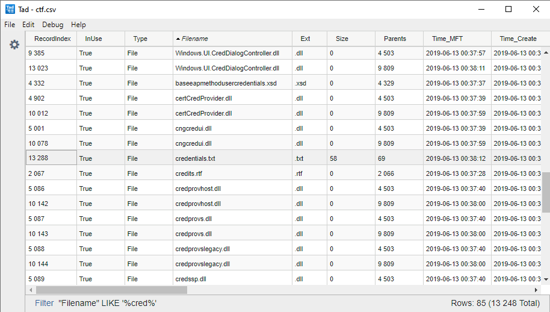

# Google CTF 2019

## Home Computer

### Description

    Blunderbussing your way through the decision making process, you figure that one is as good as the other and that
    further research into the importance of Work Life balance is of little interest to you.
    You're the decider after all. You confidently use the credentials to access the "Home Computer."
    Something called "desktop" presents itself, displaying a fascinating round and bumpy creature (much like yourself)
    labeled "cauliflower 4 work - GAN post."
    Your 40 hearts skip a beat. It looks somewhat like your neighbors on XiXaX3. ..Ah XiXaX3... 
    You'd spend summers there at the beach, an awkward kid from ObarPool on a family vacation, yearning, but without
    nerve, to talk to those cool sophisticated locals. 
    So are these "Cauliflowers" earthlings? Not at all the unrelatable bipeds you imagined them to be. Will they be
    at the party? Hopefully SarahH has left some other work data on her home computer for you to learn more.

### Solution

Let's find some credentials!

1. A file named family.ntfs?

   We can get info about the image using [info](https://github.com/thewhiteninja/ntfstool#info) command.
   It works for disk images but also volume images.

    ```
    > .\ntfstool.x64.exe info image=d:\family.ntfs  
    Info for image:
    ----------------

        Size        : 26214400 (25.00 MiBs)
        Volume      : RAW

        +--------------------------------------------------------------------+
        | Id | Filesystem | Offset           | Size                          |
        +--------------------------------------------------------------------+
        | 0  | NTFS       | 0000000000000000 | 0000000001900000 (25.00 MiBs) |
        +--------------------------------------------------------------------+```

2. Where are the creds?

   As the file is relatively small, we can dump and analyze it into a CSV file using [mft.dump](https://github.com/thewhiteninja/ntfstool#mft-dump) command.
   
   ```
   > .\ntfstool.x64.exe mft.dump image=d:\family.ntfs volume=0 format=csv output=d:\ctf.csv
   MFT Dump (inode:0) for  > Volume:0
   ----------------------------------

   [+] $MFT size   : 12.98 MiBs
   [-] Record size : 1024
   [-] Record count: 13289
   [+] Creating d:\ctf.csv
   [+] Processing data: 12.98 MiBs
   [+] Closing volume
   ```
   
3. Read the CSV

   [Tad](https://www.tadviewer.com/) is a CSV file viewer with a nice select feature as the SQL select.
   
   Here is the result when we search for "*cred*" files.
   
   
   
   We have one file (inode: 13288) named "credentials.txt".
   
4. Check the file record

   We can print the file record for this file using the [mft.record](https://github.com/thewhiteninja/ntfstool#mft-record) command.
   
   ```
   > .\ntfstool.x64.exe mft.record image=d:\family.ntfs volume=0 inode=13288
   MFT (inode:13288) for  > Volume:0
   ---------------------------------

   Signature         : FILE
   Update Offset     : 48
   Update Number     : 3
   $LogFile LSN      : 0
   Sequence Number   : 1
   Hardlink Count    : 1
   Attribute Offset  : 56
   Flags             : In use
   Real Size         : 544
   Allocated Size    : 1024
   Base File Record  : 0000000000000000h
   Next Attribute ID : 5
   MFT Record Index  : 13288
   Update Seq Number : 7
   Update Seq Array  : 00000000

   Attributes:
   -----------

   +---------------------------------------------------------------------------------------------------------+
   | Id | Type                       | Non-resident | Length | Overview                                      |
   +---------------------------------------------------------------------------------------------------------+
   | 1  | $STANDARD_INFORMATION      | False        | 48     | File Created Time       : 2019-06-13 02:38:12 |
   |    | Raw address: 000000cfe050h |              |        | Last File Write Time    : 2019-06-13 02:38:12 |
   |    |                            |              |        | FileRecord Changed Time : 2019-06-13 02:38:12 |
   |    |                            |              |        | Last Access Time        : 2019-06-13 02:38:12 |
   |    |                            |              |        | Permissions             :                     |
   |    |                            |              |        |   read_only     : 0                           |
   |    |                            |              |        |   hidden        : 0                           |
   |    |                            |              |        |   system        : 0                           |
   |    |                            |              |        |   device        : 0                           |
   |    |                            |              |        |   normal        : 0                           |
   |    |                            |              |        |   temporary     : 0                           |
   |    |                            |              |        |   sparse        : 0                           |
   |    |                            |              |        |   reparse_point : 0                           |
   |    |                            |              |        |   compressed    : 1                           |
   |    |                            |              |        |   offline       : 0                           |
   |    |                            |              |        |   not_indexed   : 0                           |
   |    |                            |              |        |   encrypted     : 0                           |
   |    |                            |              |        | Max Number of Versions  : 0                   |
   |    |                            |              |        | Version Number          : 0                   |
   +---------------------------------------------------------------------------------------------------------+
   | 2  | $FILE_NAME                 | False        | 96     | Parent Dir Record Index : 69                  |
   |    | Raw address: 000000cfe098h |              |        | Parent Dir Sequence Num : 1                   |
   |    |                            |              |        | File Created Time       : 2019-06-13 02:38:12 |
   |    |                            |              |        | Last File Write Time    : 2019-06-13 02:38:12 |
   |    |                            |              |        | FileRecord Changed Time : 2019-06-13 02:38:12 |
   |    |                            |              |        | Last Access Time        : 2019-06-13 02:38:12 |
   |    |                            |              |        | Allocated Size          : 64                  |
   |    |                            |              |        | Real Size               : 0                   |
   |    |                            |              |        | ------                                        |
   |    |                            |              |        | NameType                : POSIX               |
   |    |                            |              |        | Name                    : credentials.txt     |
   +---------------------------------------------------------------------------------------------------------+
   | 3  | $SECURITY_DESCRIPTOR       | False        | 80     | Revision                : 1                   |
   |    | Raw address: 000000cfe110h |              |        | Control Flags                                 |
   |    |                            |              |        |   owner defaulted       : 0                   |
   |    |                            |              |        |   group defaulted       : 0                   |
   |    |                            |              |        |   DACL present          : 1                   |
   |    |                            |              |        |   DACL defaulted        : 0                   |
   |    |                            |              |        |   SACL present          : 0                   |
   |    |                            |              |        |   SACL defaulted        : 0                   |
   |    |                            |              |        |   DACL auto inherit req : 0                   |
   |    |                            |              |        |   SACL auto inherit req : 0                   |
   |    |                            |              |        |   DACL auto inherit     : 0                   |
   |    |                            |              |        |   SACL auto inherit     : 0                   |
   |    |                            |              |        |   DACL protected        : 0                   |
   |    |                            |              |        |   SACL protected        : 0                   |
   |    |                            |              |        |   RM control valid      : 0                   |
   |    |                            |              |        |   self relative         : 1                   |
   |    |                            |              |        | User  SID               : S-1-5-32-544        |
   |    |                            |              |        | Group SID               : S-1-5-32-544        |
   |    |                            |              |        | SACL                    : not present         |
   |    |                            |              |        | DACL                    : D:(A;OICI;FA;;;WD)  |
   +---------------------------------------------------------------------------------------------------------+
   | 4  | $DATA                      | False        | 58     | Size: 58 (58.00 bytes)                        |
   |    | Raw address: 000000cfe178h |              |        |                                               |
   +---------------------------------------------------------------------------------------------------------+
   | 5  | $DATA                      | True         | 38202  | Name: FILE0                                   |
   |    | Raw address: 000000cfe210h |              |        | Size: 38202 (37.31 KiBs)                      |
   |    |                            |              |        | Flags:                                        |
   |    |                            |              |        |     Compressed (unit: 16 clusters)            |
   |    |                            |              |        | Dataruns:                                     |
   |    |                            |              |        |     Length: 00000009 Offset: 00001044         |
   |    |                            |              |        |     Length: 00000007 Offset: 00001044         |
   |    |                            |              |        |                                               |
   |    |                            |              |        | Virtual size: 0 (0.00 byte)                   |
   |    |                            |              |        | Real size   : 36864 (36.00 KiBs)              |
   +---------------------------------------------------------------------------------------------------------+
   ```
   
   There are two streams for this file.
   
5. Extract the file content

   With the [extract](https://github.com/thewhiteninja/ntfstool#extract) command, we can ... extract the content of a file from the inode or path.
   There is a `stream` to select the stream.
   
   ```
   > .\ntfstool.x64.exe extract image=d:\family.ntfs volume=0 inode=13288 output=d:\creds.txt
   Extract file for  > Volume:0
   ----------------------------

   [+] Opening d:\family.ntfs
   [-] Record Num  : 13288 (000033e8h)
   [-] Destination : d:\creds.txt
   [+] Extracting file...
   [+] 58 bytes (58.00 bytes) written

   > cat D:\creds.txt
   I keep pictures of my credentials in extended attributes.
   ```
   
   By `extended attributes`, it means the ADS (Alternate Data Streams).
   
   ```
   > .\ntfstool.x64.exe extract image=d:\family.ntfs volume=0 inode=13288 stream=FILE0 output=d:\hidden.dat
   Extract file for  > Volume:0
   ----------------------------

   [+] Opening d:\family.ntfs
   [-] Record Num  : 13288 (000033e8h)
   [-] Stream      : FILE0
   [-] Destination : d:\hidden.dat
   [+] Extracting file...
   [+] 38202 bytes (37.31 KiBs) written

   > file D:\hidden.dat
   D:\hidden.dat: PNG image data, 1234 x 339, 8-bit/color RGB, non-interlaced

   > mv D:\hidden.dat D:\hidden.png
   ```
   
6. EOC (End of chall)


   
